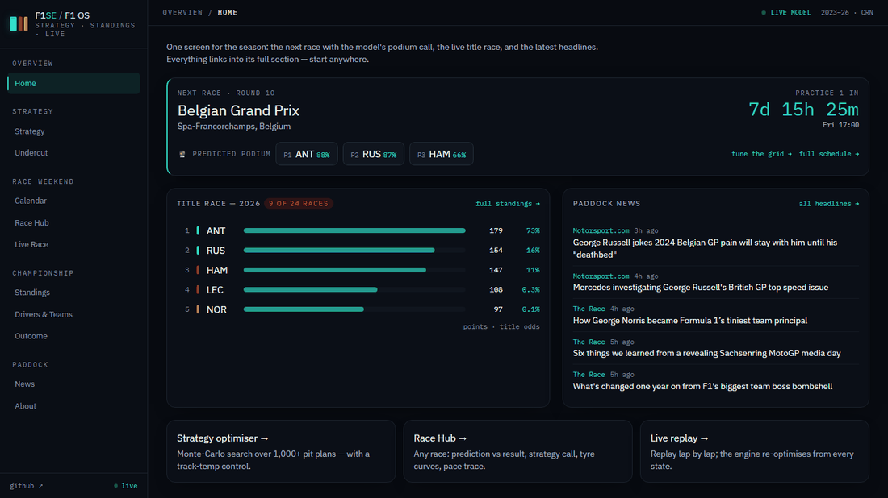
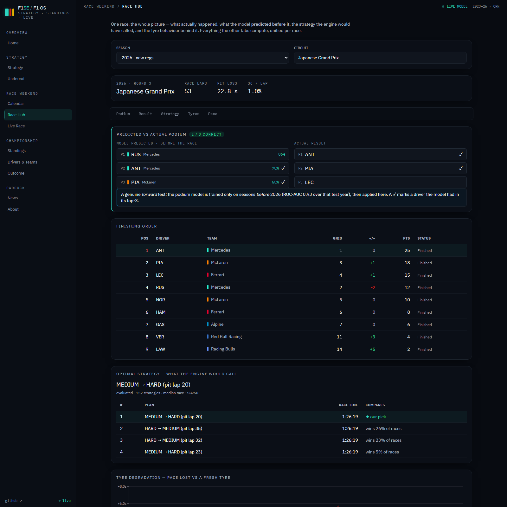

# 🏎️ F1SE / F1 OS — the F1 Strategy Engine

[](https://github.com/ShivekRanjan/f1-strategy-engine/actions/workflows/ci.yml)
[](pyproject.toml)
[](frontend/)
[](LICENSE)

**Not *who will win* — *what should the team do*.** A pit-strategy decision
engine for Formula 1 — when to stop, which tyre compounds to fit, with
quantified uncertainty, including the ongoing **2026 season** modelled across
the regulation reset — grown into a full **F1 OS**: one app for strategy,
predictions, standings, race analysis, the calendar, and the news.

### ▶ [**Live demo — f1-strategy-engine.vercel.app**](https://f1-strategy-engine.vercel.app/)

*(The API runs on a free tier that sleeps when idle — the first load can take
~30–60 s to wake it; after that it's fast.)*

[](https://f1-strategy-engine.vercel.app/)

**Results at a glance** — every number from a leakage-safe, forward-in-time test:

| Model | Scored against reality |
|---|---|
| Strategy engine (stop count) | **8/9** races match the field's dominant strategy, **7/9** the winner's (leave-one-race-out, 2026) |
| Podium model | ROC-AUC **0.93** forward-tested on 2026; British GP pre-race call **2/3** with the real grid |
| Degradation model | **0.069 s/lap** MAE on races the model never saw |
| LSTM next-lap forecast | **+8.5%** vs persistence (held-out 2025); **+18%** on a fully unseen race |

**Why this isn't another F1 dashboard:**

- **It predicts, and shows its work** — every podium prediction is displayed
  *next to what actually happened*, scored hit@3, misses included. The Race Hub
  is a forward test on display, race by race.
- **Every model beat a baseline or was rejected** — validated on leakage-safe
  splits (GroupKFold-by-race + forward-in-time), with the rejected models
  documented as receipts, not deleted ([docs/METHODOLOGY.md](docs/METHODOLOGY.md)).
- **Uncertainty is the product** — strategies come with distributions
  (typical vs bad-luck race, win-probability vs the alternatives), title odds
  bootstrap driver-strength uncertainty, and known limits are stated in the UI.

A **React + Vite** app over a **FastAPI** service wrapping the engine — nine
sections in a grouped sidebar:

| | Section | What it does |
|---|---|---|
| **Strategy** | 🏁 Strategy | Searches ~1,000+ pit strategies per race via Monte Carlo (stochastic safety cars, calibrated per circuit) and recommends the best plan — with the honest spread: *typical* vs *bad-luck* race, a track-temperature control (thermal prior), and whether the call is clear-cut or a coin-flip |
| | 🆚 Undercut | The two-car question: with a rival *N* seconds ahead, pit now to undercut or hold and cover? Models the cumulative-time crossover and returns the verdict with the seconds gained |
| **Race weekend** | 📅 Calendar | The full season schedule with a live countdown to the next session; sprint weekends badged |
| | 🎯 Race Hub | One race, the whole story: the podium model's **pre-race prediction vs the actual result** (a genuine forward test, scored hit@3), full finishing order, the engine's optimal strategy call, tyre-degradation curves, and a lap-pace trace |
| | 🔴 Live Race | Replays any race lap-by-lap and **re-optimises the remaining strategy from the current state** each lap — plus a **next-lap pace nowcast** from the LSTM |
| **Championship** | 🏆 Standings | Drivers' & constructors' tables for any season — with a live **Monte-Carlo title-win probability** per driver while the season runs |
| | 👤 Drivers & Teams | Per-season records and the classic **teammate head-to-head** (who out-qualified and out-raced whom) |
| | 🔮 Outcome | Podium probabilities (forward-tested, never a shuffled split), a live **next-race prediction** with an editable grid, and a championship projection that **bootstraps driver-strength uncertainty** so a 6-race leader doesn't show a dishonest 100% |
| **Paddock** | 📰 News | Headlines aggregated from The Race, Autosport, Motorsport.com, RaceFans and Formula1.com — link-out only |

## The models I built, tested, and kept the receipts for

Every number in this engine was either calibrated from data or explicitly
labelled as an assumption. Sophisticated models were adopted **only when they
beat a simpler baseline on a leakage-safe split** — most didn't, and those are
documented rather than deleted; one did, and it's here too:

| Finding | Evidence |
|---|---|
| **XGBoost lost to a linear baseline** on held-out races (0.42 vs 0.40 MAE) — tyre degradation is ~linear in the observed range, and the flexible model chased noise in sparse late-stint laps | identical leakage-safe folds, target, and metric for both |
| **The tyre "cliff" cannot be fitted from race data** — teams pit before it, so it's censored out of every public dataset. A quadratic fit was *worse* out-of-sample. Ships as an explicit, tunable physical prior instead | forward holdout, train ≤2023 → test 2024 |
| **The 0.03 s/kg fuel assumption survived calibration** — backing an effective coefficient out of 43 races' pace trends gives a median of 0.031 | per-race implied-β distribution |
| **Validation is leakage-safe by construction** — laps within a race are near-duplicates, so splits are GroupKFold-by-race plus a forward-in-time holdout; a shuffled split would inflate every score | `f1se/validation.py`, tested |
| **2026's regulation reset breaks old models** — a pre-2026 degradation model barely beats "no degradation" on 2026 laps (+3%); blending 2026 data with the old prior via shrinkage recovers the signal (+16%) | `analysis/phase_2026_validation.py` |
| **An LSTM *did* earn its place** — for next-lap pace forecasting it beats persistence by ~8.5% (0.306 vs 0.335s MAE on held-out 2025) by damping per-lap noise and anticipating tyre warm-up. The one case where complexity won, on the same footing — and it's live in the app (exported torch-free to a 28 KB numpy artifact) | `analysis/phase2_5_sequence.py` |
| **Validated on a race the models never saw** (Austrian GP 2026, in no training data) — LSTM nowcast **+18%** vs persistence, podium model **2/3** vs the grid's 1/3; a strategy miss surfaced (and fixed) a real degradation gap, and the model even flagged the underused softs a driver called out post-race | `analysis/backtest_austria_2026.py` |
| **A season-wide backtest exposed over-stopping — the root cause was weather, not track position** — the pooled degradation model assumed average track temp, over-predicting wear on cool days. A track-position prior (the first hypothesis) washed out 4/8; a **thermal prior** (temp-shifted degradation slope) lifted the leave-one-race-out stop-count match to **7/8** and is a live control in the UI | `analysis/backtest_2026_season.py`, METHODOLOGY §9 |

Full receipts — figures, numbers, and how to reproduce each one — in
**[docs/METHODOLOGY.md](docs/METHODOLOGY.md)**.

The discipline as a product feature — the Race Hub shows every race's
**pre-race prediction next to the actual result**, scored honestly:



## How it works

```
FastF1 ──▶ data (load, clean, fuel-correct) ──▶ models (degradation, era-shrinkage, cliff/thermal/
                                                       │    overtaking priors, LSTM forecaster)
        calibrations (safety-car hazard, pit loss) ──▶ sim (Monte Carlo, optimiser, in-race)
                                                       │
                                          engine.StrategyEngine (orchestration)
                                                       │
         standalone/ (standings, race cards, profiles, ├── api.py (FastAPI, thin)
                      news RSS, schedule — results-only)│      HTTP / JSON
                                                        └─ frontend/ (React + Vite + Tailwind)
```

The modelling lives in plain, tested functions; `api.py` is a thin wrapper over
one `StrategyEngine` plus the results-only `standalone/` modules, and the React
frontend is a pure client of that API. Per-circuit safety-car risk and pit loss
are **measured** from 78 races of track-status and in/out-lap data — not assumed.

## Quickstart

Two processes — the API and the frontend. **Backend:**

```bash
py -3.12 -m venv .venv && .venv\Scripts\Activate.ps1   # (or python3.12 -m venv on unix)
pip install -e ".[app,dev]" scikit-learn   # scikit-learn powers the outcome predictor
pytest                                     # 136 no-network tests (network ones opt-in via -m network)
uvicorn f1se.api:app --reload              # REST API + Swagger at localhost:8000/docs
pip install -e ".[models]"                 # optional: torch etc. to retrain the LSTM (heavy)
```

**Frontend** (Node 18+), in a second terminal — the committed ~8 MB of processed datasets make it run instantly:

```bash
cd frontend
npm install
npm run dev                                # UI at localhost:5173, talks to the API above
```

Rebuild the datasets from source (network; FastF1-cached, resumable):

```bash
python -m f1se.data.ingest               # dry laps (degradation model)
python -m f1se.data.ingest status        # track status (safety-car calibration)
python -m f1se.data.ingest racelaps      # pit-loss calibration
python -m f1se.standalone.results        # race results (outcome predictors)
```

Interactive API docs (FastAPI/Swagger) are served at **`/docs`** — locally at
`localhost:8000/docs`, or live at
[the deployed API's `/docs`](https://f1-strategy-engine.onrender.com/docs).
Example call:

```bash
curl -X POST localhost:8000/recommend -H 'Content-Type: application/json' \
  -d '{"track": "Japanese Grand Prix", "objective": "p85"}'
```

## Deploy

Full stack locally in one command: **`docker compose up`** → API on `:8000`,
frontend on `:5173`.

For a hosted demo, deploy the two pieces independently:

- **API** → Google Cloud Run (**recommended** — full per-request vCPU makes the
  Monte-Carlo search several times faster than a shared free tier; step-by-step
  in [deploy/CLOUD_RUN.md](deploy/CLOUD_RUN.md)) or Render (`render.yaml` +
  `Dockerfile` included; injects `$PORT`). The same `Dockerfile` serves both.
  Set `F1SE_CORS_ORIGINS` to your frontend origin to lock down CORS.
- **Frontend** → Vercel or Netlify (Vite static build). Set the project root to
  `frontend/` and `VITE_API_BASE` to the deployed API URL. See
  [frontend/README.md](frontend/README.md).

A `Keep the API awake` GitHub Action pings the deployed API every 10 min so a
free-tier instance doesn't idle out; point it at any host via the `API_URL`
repo variable.

## Data

[FastF1](https://docs.fastf1.dev/) timing, tyre, track-status, and results data,
2023–2026. The raw cache is git-ignored; the small processed datasets are
committed so the API and CI run without network. The only endpoints that touch
the network at runtime are **News** (RSS, headlines + link-out only) and the
**Calendar** (FastF1 event schedule) — both cached, both degrade gracefully
offline; everything else serves from the committed datasets.

## Known limits (stated on purpose)

- **Free-air simulator.** The optimiser prices pace, degradation, and safety-car
  risk — not on-track overtaking cost. A small labelled track-position prior
  nudges for it; it isn't a wheel-to-wheel model. It optimises the plan you can
  *commit to before the lights*, and it can't pre-book a safety car.
- **Not a live-timing feed.** Real-time streams only exist during a session;
  between sessions the Calendar counts down and the Live Race view replays. The
  UI says so rather than faking it.
- **Data window is 2023–2026.** Driver/constructor totals are for that window,
  labelled as such — not all-time career figures.
- **Free-tier hosting.** The API sleeps when idle (first load ~30–60 s to wake);
  heavy Monte-Carlo searches are slower than on paid compute.

## Roadmap

- LSTM retrain cadence automated per race (currently a frozen export).
- Per-circuit default track temperatures pre-filling the Strategy slider.
- Wet-race strategy (the engine is dry-only today; intermediates/wets are out
  of scope for the degradation model).

## License

[MIT](LICENSE) · Changelog: [CHANGELOG.md](CHANGELOG.md)
