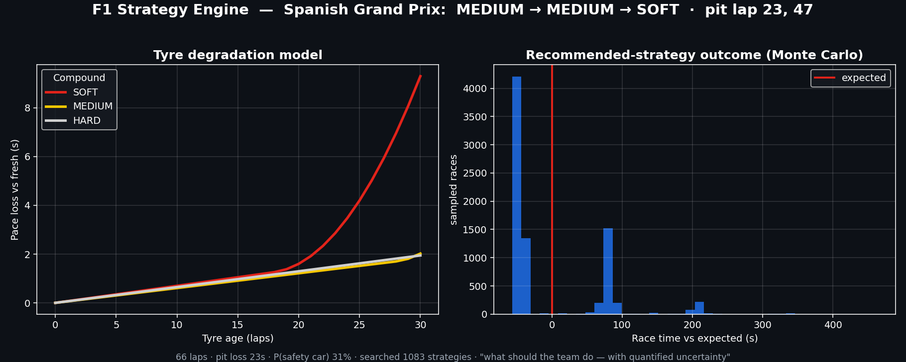

# 🏎️ F1 Strategy Engine

[](https://github.com/ShivekRanjan/f1-strategy-engine/actions/workflows/ci.yml)
[](https://f1-all-eye-u98rbzxhkgp8yu6wu9jxuq.streamlit.app)
[](pyproject.toml)
[](LICENSE)

**Not *who will win* — *what should the team do*.** A pit-strategy decision engine
for Formula 1: given a race situation, it recommends when to stop and which tyre
compounds to fit, with quantified uncertainty — including the ongoing **2026
season**, modelled across the regulation reset.

<!-- TODO: replace with assets/demo.gif (Live Race tab, lap slider) once recorded -->


**[▶ Try the live app](https://f1-all-eye-u98rbzxhkgp8yu6wu9jxuq.streamlit.app)** — three tabs:

| Tab | What it does |
|---|---|
| 🏁 **Strategy** | Searches ~1,000+ pit strategies per race via Monte Carlo (stochastic safety cars, calibrated per circuit) and recommends the best plan — with the honest spread: *typical* race vs *bad-luck* race, and whether the call is clear-cut or a coin-flip |
| 🏆 **Outcome Predictor** | Podium probabilities (forward-tested, never a shuffled split) + a live championship projection that **bootstraps driver-strength uncertainty** so a 6-race leader doesn't show a dishonest 100% |
| 🔴 **Live Race** | Replays any race lap-by-lap and **re-optimises the remaining strategy from the current state** each lap — the same engine call a live-timing feed drives on race day |

## Three models I built, rejected, and kept the receipts for

Every number in this engine was either calibrated from data or explicitly
labelled as an assumption — and the models that *didn't* earn their place are
documented, not deleted:

| Finding | Evidence |
|---|---|
| **XGBoost lost to a linear baseline** on held-out races (0.42 vs 0.40 MAE) — tyre degradation is ~linear in the observed range, and the flexible model chased noise in sparse late-stint laps | identical leakage-safe folds, target, and metric for both |
| **The tyre "cliff" cannot be fitted from race data** — teams pit before it, so it's censored out of every public dataset. A quadratic fit was *worse* out-of-sample. Ships as an explicit, tunable physical prior instead | forward holdout, train ≤2023 → test 2024 |
| **The 0.03 s/kg fuel assumption survived calibration** — backing an effective coefficient out of 43 races' pace trends gives a median of 0.031 | per-race implied-β distribution |
| **Validation is leakage-safe by construction** — laps within a race are near-duplicates, so splits are GroupKFold-by-race plus a forward-in-time holdout; a shuffled split would inflate every score | `f1se/validation.py`, tested |
| **2026's regulation reset breaks old models** — a pre-2026 degradation model barely beats "no degradation" on 2026 laps (+3%); blending 2026 data with the old prior via shrinkage recovers the signal (+16%) | `analysis/phase_2026_validation.py` |

Full receipts — figures, numbers, and how to reproduce each one — in
**[docs/METHODOLOGY.md](docs/METHODOLOGY.md)**.

## How it works

```
FastF1 ──▶ data (load, clean, fuel-correct) ──▶ models (degradation, era-shrinkage, cliff prior)
                                                       │
        calibrations (safety-car hazard, pit loss) ──▶ sim (Monte Carlo, optimiser, in-race)
                                                       │
                                          engine.StrategyEngine (orchestration)
                                                       │
                                      ┌────────────────┴────────────────┐
                                   api.py (FastAPI)             app/ (Streamlit)
```

The modelling lives in plain, tested functions; the API and UI are thin layers
over one `StrategyEngine`. Per-circuit safety-car risk and pit loss are
**measured** from 76 races of track-status and in/out-lap data — not assumed.

## Quickstart

```bash
py -3.12 -m venv .venv && .venv\Scripts\Activate.ps1   # (or python3.12 -m venv on unix)
pip install -e ".[app,dev]"
pytest                                   # 89 no-network tests
streamlit run app/streamlit_app.py       # the committed ~1.5 MB datasets make it run instantly
uvicorn f1se.api:app --reload            # REST API at /docs
```

Rebuild the datasets from source (network; FastF1-cached, resumable):

```bash
python -m f1se.data.ingest               # dry laps (degradation model)
python -m f1se.data.ingest status        # track status (safety-car calibration)
python -m f1se.data.ingest racelaps      # pit-loss calibration
python -m f1se.standalone.results        # race results (outcome predictors)
```

Example API call:

```bash
curl -X POST localhost:8000/recommend -H 'Content-Type: application/json' \
  -d '{"track": "Japanese Grand Prix", "objective": "p85"}'
```

## Deploy

`docker compose up` serves the UI (:8501) and API (:8000) from one image, or
deploy Docker-free on Streamlit Community Cloud (this repo, main file
`app/streamlit_app.py`) — `render.yaml` is included for Render/Fly.

## Data

[FastF1](https://docs.fastf1.dev/) timing, tyre, and track-status data,
2023–2026. The raw cache is git-ignored; the small processed datasets are
committed so the app and CI run without network.

## License

[MIT](LICENSE)
