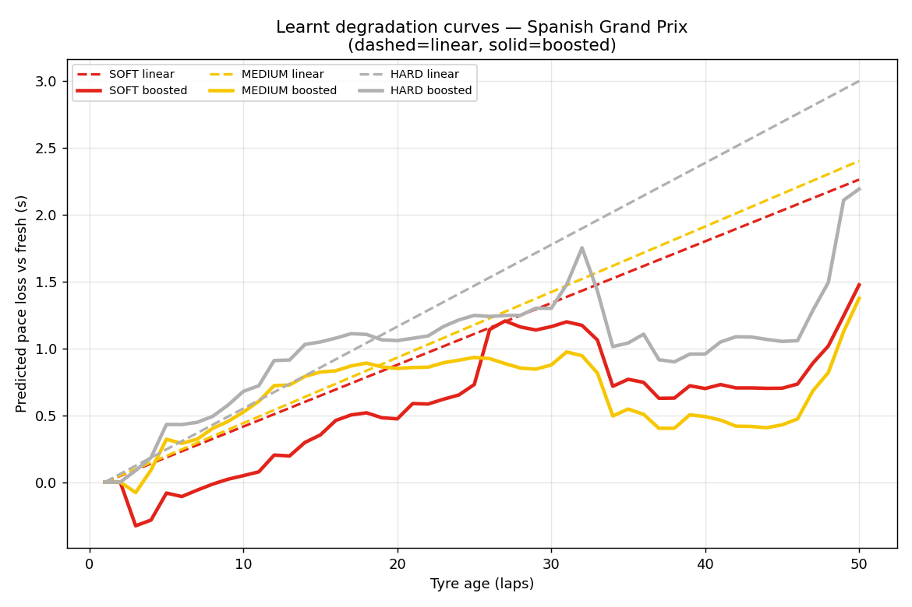
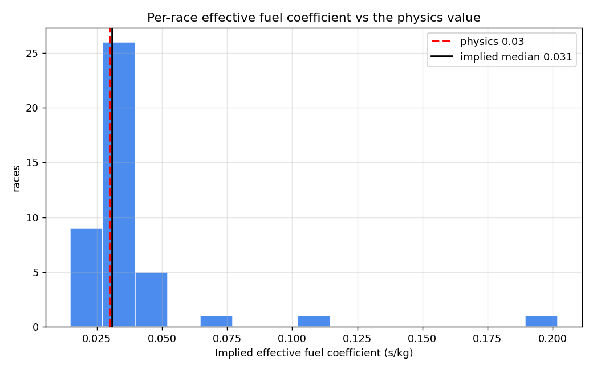
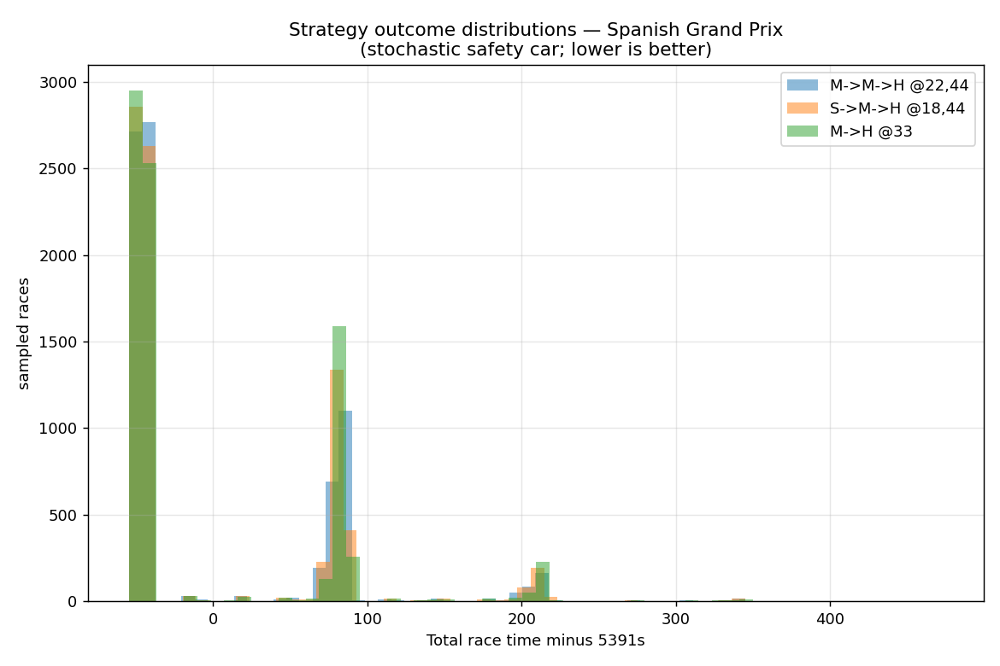
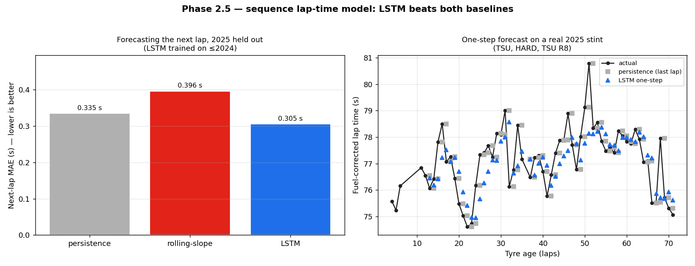

# Methodology — how every number was earned

This project's claim is not "the model is accurate"; it's that **every number is
either calibrated from data or explicitly labelled as an assumption** — and the
models that failed to earn their place are documented rather than deleted. This
page is the evidence. Each section is reproducible from a script in
[`analysis/`](../analysis/).

---

## 1. Validation that can't cheat

Laps within a race are near-duplicates (same car, track, weather, fuel run). A
shuffled train/test split puts lap 30 of a race in training and lap 31 in test,
and every score inflates. All evaluation here uses two splits instead
([`f1se/validation.py`](../src/f1se/validation.py), tested):

- **GroupKFold by race** — no race ever spans train and test;
- **forward-in-time holdout** — train on past seasons, test on a future one.

This discipline caught a real bug immediately: the first degradation model
predicted *absolute* lap time and scored 0.69s MAE in-sample — but **7.5s on
held-out races**, because base pace is track-specific and an unseen track has no
intercept. The fix (predict *within-stint pace loss*, leaving base pace to the
simulator) is what generalises: 0.40s on races the model never saw.

## 2. XGBoost lost to a straight line — and why that's the right answer

Identical leakage-safe folds, identical within-stint target, identical metric:

| Model | Pace-loss MAE, held-out races |
|---|---|
| Naive (no degradation) | 0.526 s |
| **Linear per (track, compound)** | **0.404 s** |
| XGBoost | 0.422 s |

The learnt-curve plot shows why: the boosted model tracks the line where data is
dense (tyre age ≤ ~30 laps), then chases noise in sparse, confounded late-stint
laps. Degradation is ~linear in the observed range, so added flexibility buys
variance, not signal. A synthetic test with genuinely curved degradation confirms
the comparison *can* detect curvature when it exists — there just isn't any here.

*Reproduce: `analysis/phase2_boosted.py`*

## 3. The tyre "cliff" is censored out of every public dataset

Teams pit before tyres fall off the cliff, so race data — anyone's race data —
contains almost no cliff laps. Fitting a quadratic anyway makes the model
**worse** on the forward holdout (0.497 vs 0.484 MAE) and produces physically
backwards curvature (hards come out *concave*). Practice sessions don't rescue
it: their long runs are no longer than race stints, and fuel loads are unknown.

So the cliff ships as an explicit, tunable **physical prior**
([`models/cliff.py`](../src/f1se/models/cliff.py)) — extra pace loss beyond a
per-compound onset age — with the same epistemic status as the fuel coefficient:
an assumption, labelled, adjustable, never presented as a measurement. Paired
with data-driven per-compound stint-length caps, it shifted the Spanish GP
recommendation from a 42-soft-lap plan to an 18-soft-lap plan whose soft stint
ends exactly at the cliff onset — the realistic behaviour.

*Reproduce: `analysis/phase2_forward.py` (quadratic test), `analysis/phase4_optimize.py` (effect on strategy)*

## 4. The fuel assumption survived its audit

Fuel burn makes every lap faster as the race runs, masking tyre degradation. The
correction assumes **0.03 s of lap time per kg of fuel** — a rule of thumb worth
auditing, since the measured degradation slope roughly *doubles* across the
plausible β range. Two checks:

1. **Sensitivity is analytic**: within a stint, the corrected slope shifts by
   exactly Δβ · (fuel burned per lap) ≈ Δβ · 1.69 — verified empirically, so the
   assumption's influence is known, not vague.
2. **Calibration**: backing an *effective* coefficient out of the net race-lap
   pace trend (identified from pit-stop pace jumps, where tyre age resets but
   fuel keeps falling) across 43 races gives **median β = 0.031** — right on the
   physics value. The per-race spread is wide (evolution and lift-and-coast
   confound any single race), so only the pooled median is trusted.

*Reproduce: `analysis/phase1_eda.py` (sensitivity), `analysis/phase2_calibrate.py` (calibration)*

## 5. A decomposition that didn't work — kept as a diagnostic

An attempt to separate *track evolution* (grip improving as the circuit rubbers
in) from degradation failed honestly: a linear-in-lap evolution term is
**collinear with the fuel correction** (fuel mass is also linear in lap), so the
fitted "evolution" absorbed fuel miscalibration and late-race management instead
— coming out *positive* (pace fading), the opposite of rubber-in. The module
survives as a documented diagnostic of the net lap-trend, not as a correction.
The lesson generalised: for this data, the within-stint bundled estimate is the
*right* predictive object for a strategy simulator anyway.

*Reproduce: `analysis/phase2_evolution.py`*

## 6. Safety cars and pit loss are measured, not assumed

Safety cars dominate outcome uncertainty — the race-time distribution is
multi-modal, with clusters ~2 minutes apart corresponding to 0/1/2 SC periods:

The hazard model was therefore calibrated from 76 races of per-lap track-status
data: **0.0105 SC triggers per lap, mean duration 4.1 laps** (the literature
default of 0.013/4 was close). The real gain is **per-circuit** rates with
partial pooling — Australia/Canada/Qatar average ~1.5 SC periods per race while
Spain had zero in 2023–24, and shrinkage keeps the zero-observation tracks at a
sensible non-zero hazard. The same treatment gives per-circuit pit loss from
in/out-lap deltas (Spa 19.0s … Spain 23.4s … Singapore 29.4s — matching the
known pit-lane geometry).

*Reproduce: `analysis/phase3_sc_calibrate.py`*

## 7. 2026: modelling across a regulation reset

2026 rewrote the cars, so pre-2026 models are biased and 2026 data is scarce —
a textbook bias–variance trade resolved component-wise:

- **Transferable components** (pit-lane loss, SC hazard, fuel physics) pool all
  seasons.
- **Regime-sensitive components** (base pace, degradation) use a **shrinkage
  estimator**: each per-group slope is a precision-weighted blend of the 2026
  estimate and the pre-2026 prior, converging to 2026 truth as races accumulate.

Measured on real 2026 laps, the regime shift is large and the fix works:

| Degradation model | Pace-loss MAE on 2026 laps | vs naive |
|---|---|---|
| Naive (no degradation) | 0.590 s | — |
| Pre-2026 (old cars) | 0.573 s | **+3%** — barely useful |
| **Shrunk (2026-aware)** | **0.495 s** | **+16%** |

The championship projection applies the same humility: with only a handful of
2026 rounds, each simulation **bootstraps driver strength** from the races seen
so far, so a dominant leader shows ~99% — not a dishonest 100% — and close form
yields genuinely open odds.

*Reproduce: `analysis/phase_2026_validation.py`*

## 8. The one time complexity won — a sequence model for next-lap pace

Everywhere else the simpler model won. So the head-to-head framework owed the
deep-learning option the same fair shot — and here it took it. The task is
**one-step-ahead forecasting**: standing at lap *t* of a stint, predict lap
*t+1*'s fuel-corrected time. An LSTM reads the recent run of laps; to stop it
memorising track base pace (the same leakage trap §1 caught), it predicts the
lap-to-lap **delta** Δ = pace[t+1] − pace[t], so the per-stint level cancels and
it can only win by predicting *change*.

Forward-in-time, train ≤2024, test on 2025 (2026 excluded — regime reset):

| Next-lap predictor | MAE on held-out 2025 laps |
|---|---|
| Rolling-slope (extrapolate local trend) | 0.396 s |
| Persistence (next lap = last lap) | 0.335 s |
| **LSTM (sequence → delta)** | **0.306 s** (±0.001 over 3 seeds) |

The LSTM beats the dumb baseline by **~8.5%** — small but real and reproducible.
Two honest readings come with it. First, the *rolling-slope* baseline is **worse
than persistence**: at a one-lap horizon, fuel-corrected pace is close to a random
walk, so naively projecting a 5-lap slope just amplifies per-lap noise — a useful
reminder that "more model" can hurt even among baselines. Second, the LSTM's edge
is exactly that it **damps the noise persistence copies** and anticipates tyre
warm-up and settling: in the figure it predicts *below* the lap-51 spike instead
of chasing it.

The same leakage discipline applied to the model's own inputs. An early draft fed
a "stint fraction" feature = tyre age ÷ *the stint's final age* — which silently
leaks how long the stint will end up being (i.e. when the team pits, a future
decision). It was removed; the result barely moved (0.305 → 0.306), confirming
the edge came from the genuine lap-to-lap sequence, not from peeking ahead.

Scope, stated plainly: this is a *nowcasting* gain on raw next-lap pace, **not** a
replacement for the degradation model in the strategy simulator — the simulator
needs a full-stint pace curve as a function of tyre age, which the within-stint
fixed-effects model supplies directly, not a one-step autoregressor seeded by
recent laps. It's surfaced where it belongs: the **Live Race tab's next-lap
nowcast**. To keep that deployable on a torch-free host, the trained network is
exported to a 28 KB numpy weights file and its LSTM forward pass re-implemented in
numpy (a parity test pins the two to within 1e-6), so the live app ships the model
without the heavy dependency.

*Reproduce: `analysis/phase2_5_sequence.py`*

## 9. The real test: a race the models had never seen (Austrian GP 2026)

Held-out *seasons* are one thing; a brand-new race is the honest one. The Austrian
GP 2026 is in **none** of the committed data, so it's a clean out-of-sample check
of the whole build at once — pulled from FastF1 and compared to what actually
happened (winner **RUS**, from a medium → hard → hard 2-stop).

| Check | Result |
|---|---|
| **Strategy — race shape** | ✅ engine got 71 laps and a **2-stop** (15 of 19 finishers 2-stopped) |
| **Strategy — compound pick** | ❌ engine's compounds differed from the winner's |
| **LSTM nowcast** | ✅ **+18.2%** vs persistence (0.31 vs 0.38 s) — *better* than its 2025 holdout |
| **Podium model** | ✅ **2/3** correct (RUS, ANT) vs the grid baseline's **1/3** |
| **Degradation** | ~ right ballpark, but slopes ran gentle (model MEDIUM 0.081 vs actual 0.097 s/lap) |

The strategy compound miss traced straight to the degradation under-estimate:
the model thought the mediums were more durable than they were, so it over-valued
running them. That exposed a real gap — a track raced in 2023–25 but not yet in
2026 kept its **stale pre-reset slope**, ignoring the regulation change entirely.

**The fix (regime- and recency-aware degradation).** Two changes, both principled:
recency-weight the target-era estimate (recent races weigh more, so mid-season
**car upgrades** propagate in 1–2 races instead of being averaged flat), and
propagate the compound-level 2026 era shift onto tracks not yet run in 2026. After
this, Austria's slopes moved measurably closer to the truth on all three compounds.

**The twist that validated it.** The updated model then recommended a **soft**
middle stint — which looked wrong (the field avoided softs) until the data was
actually checked: soft degradation at Austria was the **lowest** of the three
(0.060 vs medium 0.097, hard 0.088 s/lap), over 130 laps and 7 drivers. The
model's soft lean was a *real* signal, not noise — and it matched a driver's
post-race comment that the softs were quick and the teams didn't commit to them.
Honest caveat: the winner still won on hards, so softs were a genuine *underused
option*, not proven optimal — exactly the kind of edge a strategy tool should
surface for humans to weigh.

*Reproduce: `analysis/backtest_austria_2026.py` (network — pulls the race from FastF1)*

**Extended to the whole 2026 season (leave-one-race-out).** Across all 8 completed
2026 rounds, each race is predicted by a model **refit without that race**, so every
check is out-of-sample. Degradation is close (**0.07 s/lap MAE**), and the engine
matched the field-dominant stop-count on **4/8** races. The misses are *systematic
and explainable*, not random: at durable-tyre circuits where the field one-stops to
hold track position (Japan: **21 of 22 drivers one-stopped**), the engine's free-air
*time*-optimal plan recommends an extra stop — because it models pace and degradation
but **not overtaking cost / track position**. It matches where the field genuinely
two-stopped (Monaco, Austria). A clean, honest boundary of a free-air strategy model.

That boundary prompted a fix — and the fix is itself a lesson in validating a
hypothesis. The intuition was "add a track-position penalty so the optimiser
stops over-stopping at processional circuits." But the **data refused the
hypothesis**: the over-stopping is mostly at *easy*-to-overtake circuits
(Australia/China/Canada shuffle their grid the most), while the engine already
agrees where overtaking is genuinely hard. So a difficulty-scaled penalty targets
the wrong tracks. What shipped is an [`OvertakingPrior`](../src/f1se/models/overtaking.py)
— a labelled, tunable per-stop cost (mostly uniform: the out-lap, traffic, and
execution cost the free-air sim omits; plus a *small* term that grows with
data-derived overtaking difficulty). It cleanly fixes the one textbook case
(Suzuka), but honestly it's a **nudge, not a cure**: the bulk of the over-stopping
is a pace/degradation-calibration matter, not track position, and pushing the
prior harder just under-stops genuine high-degradation two-stop tracks. Kept on by
default, documented for exactly what it does and doesn't do.

**Then the real cause: weather.** Digging past the track-position red herring, the
model's per-race degradation error lined up cleanly with **track temperature** — it
*over*-predicts wear on a cool day (China 23 °C, Canada 18 °C) and *under*-predicts
on a hot one (Barcelona 50 °C), because the pooled fit assumes an average
temperature. That mis-estimate is what made the optimiser over-stop at cool races
and under-rate the genuine multi-stop at hot ones. The fix is a
[`ThermalPrior`](../src/f1se/models/thermal.py) that shifts the degradation slope
with track temperature (direction is physics, magnitude data-informed — a labelled
prior, like the cliff). Feeding each race its real temperature lifted the
field-dominant stop-count match from **4/8 to 7/8** (and 3/8 → 6/8 vs the winner) —
and, satisfyingly, *undid* the Barcelona regression the overtaking prior had caused.
It's a live control in the app: an **expected-track-temp slider** on the Strategy
tab — cooler ⇒ fewer stops, hotter ⇒ more. Canada (coldest, but genuinely
tyre-punishing) is the one honest miss that remains.

*Reproduce: `analysis/backtest_2026_season.py` (uses each race's FastF1 track temp)*

## 10. From engine to F1 OS — the same validated pieces, resurfaced

The app later grew from four strategy views into a nine-section **F1 OS**
(standings, race hub, driver/team profiles, calendar, news). Methodologically,
almost nothing new was modelled — the point was to *reuse* the validated pieces
where people actually look:

- **Standings** attach a title-win probability per driver from the same
  bootstrap championship simulator (§7's honesty device: a few-race leader
  shows ~90%, not a dishonest 100%).
- **The Race Hub** turns §9's discipline into a product feature: for any race,
  the podium model's **pre-race** prediction (trained only on earlier seasons)
  is shown next to the actual result and scored **hit@3** — every race card is
  a small forward test on display, misses included.
- **The Calendar** surfaces the next-race podium prediction where people check
  the schedule, and says plainly that the grid defaults to qualifying form
  until the real grid exists.
- **News** is headlines + link-out only (RSS); **live timing** was deliberately
  *not* faked: real-time data only streams during a session, so between
  sessions the calendar counts down and the Live Race view replays — the UI
  says so instead of pretending.

Two data-honesty items surfaced during the build and were fixed rather than
papered over: an all-NaN 2021 results ingest (dropped — the window is
2023–2026 and now says so), and profile "career" totals that were really
window totals (relabelled **"2023–26 totals · not all-time career"**).

---

### The pattern

Five times the sophisticated option (boosted trees, a fitted cliff, a
recalibrated fuel coefficient, an evolution decomposition, trusting six races of
2026 form) was built, evaluated honestly, and **rejected in favour of a simpler,
better-validated alternative**. The sixth time — the sequence model — complexity
**earned its place** on the identical leakage-safe footing. That's the whole
point: the framework isn't biased toward simple *or* complex; it's biased toward
what the held-out data supports. Parsimony plus domain knowledge, verified at
every step.
